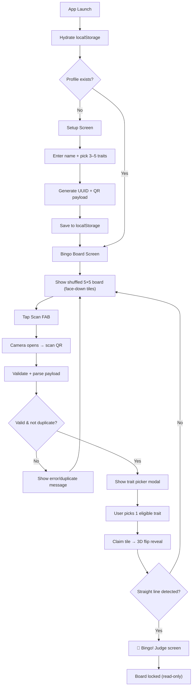

# 🎯 ASTRA-101 Bingo Icebreaker — Unified Plan

## Outcome

Deliver a mobile-first Vite + React + TypeScript PWA for an in-person bingo
icebreaker. After the first successful load, the complete application works
without a network connection: profile setup, board generation, QR display and
scanning, state persistence, rerolls, and reset.

Each participant creates a profile consisting of a name and 3–5 bingo traits.
Their device renders that profile as a QR code. A participant scans another
participant's QR code, chooses one eligible trait from it, and the matching
hidden square on their own board is revealed with the provider's name. A row,
column, or diagonal triggers a judge-facing Bingo screen.

---

## Architecture



---

## Technology & architecture

| Concern | Choice |
|---|---|
| App | Vite, React, TypeScript |
| Icons | `lucide-react` only |
| QR render | `qrcode.react` |
| QR camera | `html5-qrcode` (loaded only while scanner is open) |
| PWA | `vite-plugin-pwa` with Workbox `generateSW` |
| State | React reducer/context with versioned localStorage document |
| Styling | Vanilla CSS — dark glassmorphism theme, reduced-motion support |
| Fonts | Bundled `Inter` (no runtime CDN requests for offline support) |

---

## Data model

### Single versioned persistence key: `astra-bingo:v1`

All application state lives in one coordinated localStorage object. Validate
and discard/migrate malformed data at app startup.

```json
{
  "version": 1,
  "profile": {
    "id": "a1b2c3d4-...",
    "name": "Juan",
    "traitIds": ["side-project", "pet", "coffee"]
  },
  "board": {
    "shuffleOrder": ["ai-research", "another-year", "linkedin", "...24 trait ID strings shuffled"],
    "tiles": {
      "0": null,
      "1": {
        "traitId": "pet",
        "provider": {
          "profileId": "x9y8z7-...",
          "name": "Maria",
          "traitIds": ["pet", "coffee", "github"]
        }
      },
      "12": { "traitId": "free", "provider": null }
    },
    "winningLine": null,
    "bingoAchieved": false
  },
  "scannedProfileIds": ["x9y8z7-...", "p4q5r6-..."]
}
```

Use **trait IDs** as program data and labels/icons only as presentation data.
This prevents QR compatibility from breaking if display text is edited.

### QR payload

Base64url-encoded JSON — not delimiter-separated — so names with special
characters cannot corrupt parsing:

```json
// Before encoding:
{ "v": 1, "id": "a1b2c3d4-...", "name": "Juan", "traits": ["side-project", "pet", "coffee"] }
// QR string: "BINGO:" + base64url(JSON.stringify(payload))
```

Validation on scan:
- Correct version/schema
- Known trait IDs (from the 24-item catalogue)
- Exactly 3–5 traits, no duplicate trait IDs
- Non-empty, bounded display name
- Not the current user's own profile ID

---

## Trait catalogue with icons

Use these labels verbatim. Each item has a stable ID and a Lucide icon:

| # | ID | Label | Lucide Icon |
|---|---|---|---|
| 1 | `side-project` | Has a side project | `Code` |
| 2 | `another-course` | From another course | `GraduationCap` |
| 3 | `another-year` | From another year | `CalendarRange` |
| 4 | `ai-image-tool` | Tried an AI image tool | `ImagePlus` |
| 5 | `night-owl` | Night owl | `Moon` |
| 6 | `pet` | Has a pet | `PawPrint` |
| 7 | `github` | Has GitHub | `Github` |
| 8 | `chatgpt` | Has used ChatGPT | `MessageCircle` |
| 9 | `ai-study` | Uses AI to study | `BrainCircuit` |
| 10 | `creative-hobby` | Has a creative hobby | `Palette` |
| 11 | `vibecoding` | Has tried vibecoding | `Zap` |
| 12 | `astra-followers` | Follows ASTRA Developers | `Users` |
| — | `free` | **FREE SPACE** | `Star` |
| 13 | `hackathon` | Has joined a hackathon | `Trophy` |
| 14 | `ai-research` | Uses AI for research | `Search` |
| 15 | `cram` | Loves to cram | `BookOpen` |
| 16 | `idea-to-build` | Has an idea to build | `Lightbulb` |
| 17 | `coffee` | Loves coffee | `Coffee` |
| 18 | `ai-event` | Has attended an AI event | `CalendarCheck` |
| 19 | `knows-nobody` | Came here knowing nobody | `UserX` |
| 20 | `debug-ai` | Has debugged with AI | `Bug` |
| 21 | `only-child` | Is an only child | `User` |
| 22 | `linkedin` | Has LinkedIn | `Linkedin` |
| 23 | `business-idea` | Has a business idea | `Briefcase` |
| 24 | `fav-ai-tool` | Has a favorite AI tool | `Sparkles` |

---

## Screens & interactions

### 1. Setup Screen

- Text input for **display name** (trimmed, non-empty, bounded length)
- Accessible selectable grid of all 24 traits displayed as cards with icons
- Selected-count status badge (e.g., "3/5 selected") with min/max enforcement
- Validation feedback for edge cases (blank name, whitespace-only, <3 or >5 traits)
- **"Start Playing"** button → generates UUID + QR payload, saves profile, navigates to board

### 2. Bingo Board Screen (main)

- **Header** with app title, **"My QR"** button, and **settings gear** icon
- **5×5 grid**, uniquely shuffled per player on first load (persisted)
- Center tile = **FREE SPACE** (auto-marked, always revealed with `Star` icon and golden gradient)
- Each non-free tile:
  - **Initially face-down** — shows a card-back pattern with `?` icon and subtle ASTRA branding. Description, icon, and name are hidden.
  - **When claimed** — performs a **CSS 3D flip animation** revealing the Lucide icon + trait label + the **provider's name** underneath
- **Floating action button (FAB)** → opens QR scanner
- Claimed tiles are **tappable buttons** → opens a detail sheet showing the provider's full info (name + all their selected traits)
- After bingo: board is **read-only**, FAB is disabled, claimed tiles remain inspectable

### 3. My QR Dialog

- Full-screen modal with high-contrast QR code (generous quiet zone + sizing for phone cameras)
- Player's name displayed prominently
- Brief instruction text: "Show this to other players to scan"
- Close button

### 4. QR Scanner Dialog

- Camera permission explanation on first use
- Live camera feed with scan region overlay
- Cancel button + retry control
- **Manual payload input fallback** for devices without a usable camera (paste text field)
- On valid scan → auto-close camera → show Trait Picker
- **Camera cleanup**: stop and release camera stream immediately after valid scan or close (critical for `html5-qrcode`)

### 5. Trait Picker Dialog

- Shows scanned user's **name** prominently
- Lists their **3–5 traits** as selectable cards with icons
- Only traits matching **unclaimed tiles** on the scanner's board are **enabled**
- Already-claimed traits show greyed-out "Already filled" label with reason
- If **no traits are eligible**: all greyed out with explanatory message — person is **NOT** added to scan history (preserving future re-scan ability)
- If person's **UUID already in scan history**: show "You've already scanned [Name]!" message — no second claim
- Cancel button that changes no game state
- Player picks **one trait** → tile claims, 3D flip, dialog closes

### 6. Bingo Judge View

- Full-screen celebration overlay with **confetti animation** and glow effects
- Large text: **"🎉 BINGO! Show this to a judge"**
- Displays:
  - **Player's name** (large)
  - **Winning line highlighted** on a mini board view
  - **List of contributors** — name of each person who filled a tile in the winning line (FREE SPACE excluded)
- **"Back to Board"** button to return to read-only board
- Game is locked after first bingo — no further claims unless rerolled/reset

### 7. Settings Dialog

- **"Reroll Board"** — confirmation dialog → keeps profile, reshuffles board, clears all claims, winning state, **and scan history** (necessary for the new board to be playable)
- **"Clear All Data"** — confirmation dialog → removes only application-owned storage keys (NOT `localStorage.clear()`), returns to setup screen

---

## Design system

- **Theme**: Dark mode — deep navy/indigo backgrounds
- **Surfaces**: Glassmorphism tiles with `rgba(30, 41, 82, 0.8)`, subtle borders, `backdrop-filter: blur`
- **Colors**:
  - Primary: Electric blue `#6C63FF` / `#818CF8`
  - Accent: Cyan/teal for interactive highlights
  - FREE SPACE: Golden gradient
  - Claimed tiles: Subtle glow border
  - Face-down tiles: Muted card-back pattern
- **Typography**: Bundled `Inter` — no CDN dependency
- **Animations**:
  - Card flip: CSS 3D transforms (`transform-style: preserve-3d`, `backface-visibility: hidden`)
  - Pulse/glow on claimed tiles
  - Confetti burst on bingo
  - Smooth modal enter/exit transitions
  - All animations respect `prefers-reduced-motion: reduce`
- **Touch targets**: Minimum 44×44px for all interactive elements
- **Keyboard navigation**: All dialogs trap focus, tiles are keyboard-accessible

---

## File structure

```
src/
├── main.tsx                    # App entry + SW registration
├── App.tsx                     # Router/layout + state hydration
├── index.css                   # Global styles, design tokens, animations
├── data/
│   └── bingoItems.ts           # 24 BingoItem records (ID, label, icon component)
├── context/
│   └── GameContext.tsx          # Reducer + provider (profile, board, claims, reroll, reset)
├── hooks/
│   └── useBingoDetection.ts    # Pure function: check 5 rows, 5 cols, 2 diagonals
├── screens/
│   ├── SetupScreen.tsx         # Name input + trait selection grid
│   └── BoardScreen.tsx         # Main board + FAB + header
├── components/
│   ├── BingoGrid.tsx           # 5×5 grid layout
│   ├── BingoTile.tsx           # Face-down / revealed states + flip animation
│   ├── QRDisplay.tsx           # My QR full-screen dialog
│   ├── QRScanner.tsx           # Camera scanner + manual fallback
│   ├── TraitPicker.tsx         # Pick one eligible trait from scanned user
│   ├── TileDetailModal.tsx     # Read-only provider info on claimed tile tap
│   ├── BingoCelebration.tsx    # Judge-facing bingo proof screen
│   ├── SettingsMenu.tsx        # Reroll / Clear all data
│   ├── ConfirmDialog.tsx       # Reusable confirmation modal
│   └── Header.tsx              # App bar with title, My QR, settings gear
└── utils/
    ├── qrCodec.ts              # Encode (base64url JSON) + decode + validate
    ├── shuffle.ts              # Fisher-Yates shuffle (pure function)
    └── storage.ts              # Versioned read/write/migrate/clear for astra-bingo:v1
```

---

## Implementation phases

### Phase 1: Scaffold & foundation
- Init Vite + React + TypeScript project
- Install dependencies (`lucide-react`, `qrcode.react`, `html5-qrcode`, `vite-plugin-pwa`)
- Bundle `Inter` font locally (no CDN)
- Set up `index.css` with full design system: tokens, dark theme, glassmorphism, card-flip keyframes, reduced-motion
- Configure `vite-plugin-pwa` with manifest, icons (192px + 512px), standalone display
- Verify production build boots

### Phase 2: Data, state & utilities
- Define 24 `BingoItem` records with IDs, labels, and Lucide icon components
- Implement Fisher-Yates shuffle as a pure function
- Implement bingo line detection (5 rows, 5 cols, 2 diagonals) as a pure function
- Build QR codec: base64url encode/decode + schema validation
- Build versioned `storage.ts`: read, write, migrate, corruption recovery
- Build `GameContext` reducer: `createProfile`, `createBoard`, `claimTile`, `rerollBoard`, `clearAll`

### Phase 3: Setup screen
- Name input with trim/validation
- Trait selection grid (cards with icons, selected state)
- Selected-count badge with min/max enforcement
- UUID generation + profile save → navigate to board

### Phase 4: Bingo board & settings
- Render shuffled 5×5 grid with face-down tiles
- FREE SPACE auto-revealed with golden gradient
- CSS 3D card flip animation on claim
- Claimed tile tap → `TileDetailModal` with provider info
- Header with settings gear
- `SettingsMenu` with Reroll Board + Clear All Data (both with `ConfirmDialog`)

### Phase 5: QR flow
- `QRDisplay` — full-screen My QR dialog with name + instruction
- `QRScanner` — camera feed, permission handling, manual paste fallback
- Camera cleanup on close/scan (release stream immediately)
- Parse + validate scanned payload
- Self-scan rejection, duplicate-scan detection
- `TraitPicker` — enabled/disabled traits, single claim, no-eligible handling

### Phase 6: Bingo detection & judge view
- Check all 12 lines after every claim
- Persist winning line indexes
- `BingoCelebration` — confetti, player name, highlighted line, contributor list
- Post-win lockout: board read-only, FAB disabled, "Back to Board" from judge view

### Phase 7: PWA, accessibility & polish
- Verify service worker precaches all assets (JS, CSS, fonts, icons)
- Add non-disruptive update-ready prompt for new SW versions
- Test offline launch after initial online load
- Ensure all dialogs trap focus, all tiles keyboard-accessible
- `prefers-reduced-motion` disables flip/confetti animations
- Touch targets ≥ 44px
- Responsive layout testing (small phones to tablets)
- Note: camera scanning requires HTTPS or localhost

---

## Verification & acceptance tests

- **Shuffle**: output contains all 24 IDs, no duplicates, different order across seeds
- **QR codec**: valid encode/decode round-trip, reject malformed JSON, wrong version, unknown trait IDs, <3 or >5 traits, empty name, oversized payload
- **Board claims**: claim updates correct tile, stores provider snapshot immutably, rejects duplicate profileId, handles no-eligible gracefully
- **Reroll**: new shuffle, cleared tiles + win state + scan history, profile preserved
- **Reset**: all app-owned keys removed (not `localStorage.clear()`), returns to setup
- **Bingo detection**: test all 5 rows, 5 cols, 2 diagonals, including lines through FREE SPACE
- **Setup validation**: blank name, whitespace-only, 2/3/5/6 traits, duplicate trait selection
- **Scan edge cases**: self QR, malformed QR, non-BINGO QR, duplicate person, no eligible traits → not added to history
- **Post-win**: board read-only, FAB disabled, judge view accessible, reroll/reset still work
- **Responsive**: Android/iOS phone sizes, keyboard-only navigation, screen-reader labels
- **Camera**: denied permission shows fallback, manual entry works, camera released on close
- **PWA**: production build, install, reload offline, game state persists across refresh

---

## Confirmed event rules

1. **One claim per person:** A scanned participant may complete exactly one
   square, using one of the traits they selected when setting up their profile.
   Their QR cannot be used for another claim on the same board.
2. **Reroll clears scan history:** Reroll resets the board's claims and win
   state, and makes all previously scanned participants eligible again. It keeps
   the player's profile.
3. **Judge verification:** The judge view is visual proof only. There is no
   judge login, server record, or anti-cheat validation.
4. **Post-win board:** After the first straight bingo, the board is read-only.
   The player can show the judge view, inspect claimed-tile details, reroll, or
   perform a full reset, but cannot make further claims.
5. **Profile changes:** There is no Edit Profile action. Changing a name or
   selected traits requires Clear All Data / full reset, which removes the
   profile and board before setup begins again.
6. **No-match scans:** If a scanned person has no traits matching unclaimed
   tiles, they are NOT added to scan history and can be scanned again later
   (e.g., after a reroll).
